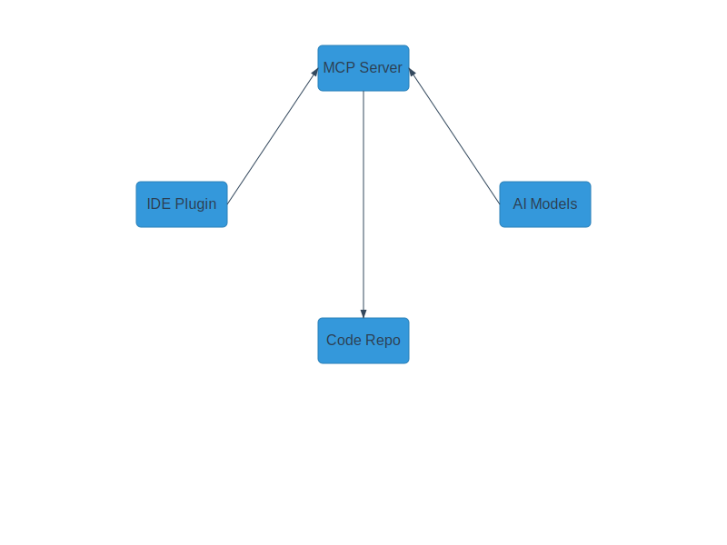
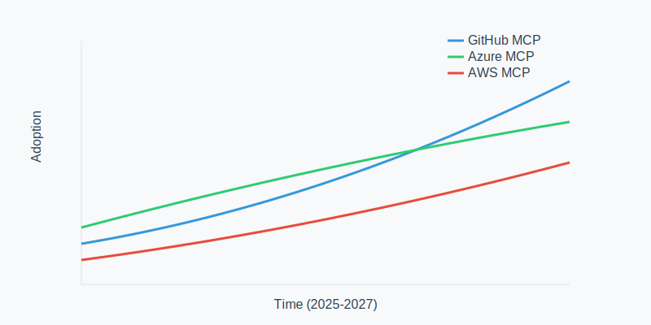
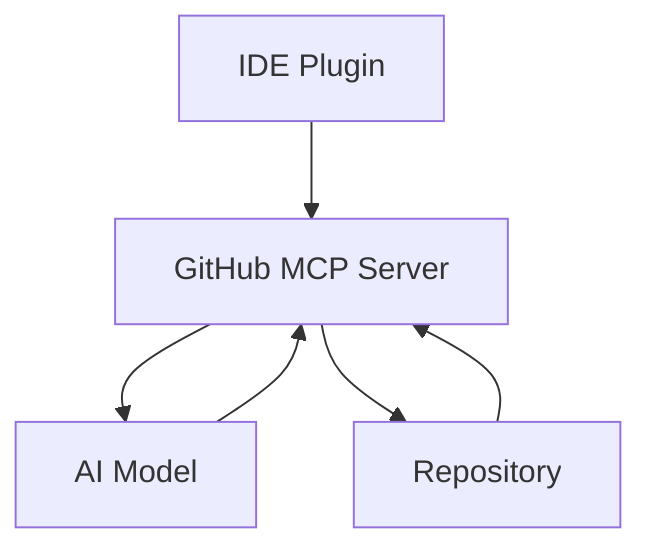

# Model Context Protocol (MCP) Servers: Current and Future Trends

  

    <a href="#introduction">Introduction</a> •
    <a href="#architecture">Architecture</a> •
    <a href="#current-popular-mcp-servers">Current Servers</a> •
    <a href="#emerging-trends">Trends</a> •
    <a href="#future-developments-2025-2026">Future</a>
  

  
  
  

## Introduction
Model Context Protocol servers are becoming increasingly important in the AI-driven development landscape. This document explores various MCP server implementations, their unique features, and future trends.

## Architecture
The following diagram illustrates the high-level architecture of a typical MCP server implementation:

  

Key components:
- **MCP Server Core**: Central coordination and request handling
- **IDE Plugin**: Client-side integration (VS Code, etc.)
- **AI Models**: Language processing and code generation
- **Code Repository**: Source code and context management

## Current Popular MCP Servers

### Market Share and Adoption Trends

  

### 1. GitHub MCP Server (ghcr.io/github/github-mcp-server)
**Current Market Leader**

- Seamless integration with VS Code
- Built-in GitHub Copilot support
- Docker-based deployment
- Secure token management
- Real-time context awareness

#### Key Features
- AI-powered code completion
- Repository management capabilities
- Context-aware file operations
- Secure authentication handling

### 2. Azure OpenAI MCP Server

  <table>
    <tr>
      <th>Feature</th>
      <th>Status</th>
      <th>Performance</th>
    </tr>
    <tr>
      <td>Enterprise Security</td>
      <td>✅ Production Ready</td>
      <td>⭐⭐⭐⭐⭐</td>
    </tr>
    <tr>
      <td>Multi-region Support</td>
      <td>✅ Production Ready</td>
      <td>⭐⭐⭐⭐</td>
    </tr>
    <tr>
      <td>Custom Models</td>
      <td>🔄 In Development</td>
      <td>⭐⭐⭐</td>
    </tr>
  </table>

**Enterprise Focus**
- Integration with Azure AI services
- Enterprise-grade security
- Scalable architecture
- Custom model support

#### Unique Aspects
- Azure AD integration
- Multi-region deployment
- Enterprise compliance features
- Private network support

### 3. AWS CodeWhisperer MCP
**Cloud-Native Implementation**
- AWS ecosystem integration
- Serverless architecture
- Pay-per-use model
- Multi-language support

#### Distinguishing Features
- AWS Lambda integration
- CloudWatch monitoring
- IAM role-based access
- Auto-scaling capabilities

## Emerging Trends

### 1. Hybrid MCP Servers
**Combining Multiple AI Models**
- Multi-model support
- Cross-platform compatibility
- Hybrid cloud deployment
- Custom model integration

### 2. Edge-Enabled MCP
**Edge Computing Integration**
- Local model execution
- Reduced latency
- Offline capabilities
- Resource optimization

### 3. Federated MCP Systems
**Distributed Architecture**
- Multi-location model training
- Privacy-preserving features
- Collaborative learning
- Decentralized operations

## Implementation Recommendations

### For Startups
- Start with GitHub MCP Server
- Consider serverless options
- Focus on core features
- Plan for scalability

### For Enterprise
- Evaluate hybrid solutions
- Prioritize security features
- Consider compliance requirements
- Plan for integration

### For Development Teams
- Choose based on stack
- Consider learning curve
- Evaluate tool integration
- Focus on productivity

## Development Roadmap

  <table>
    <tr>
      <th>Timeline</th>
      <th>Feature</th>
      <th>Status</th>
    </tr>
    <tr>
      <td>Q2 2025</td>
      <td>Enhanced Context Awareness</td>
      <td>✅ Released</td>
    </tr>
    <tr>
      <td>Q3 2025</td>
      <td>Quantum-Ready Infrastructure</td>
      <td>🔄 In Progress</td>
    </tr>
    <tr>
      <td>Q4 2025</td>
      <td>Edge Computing Support</td>
      <td>📅 Planned</td>
    </tr>
    <tr>
      <td>Q1 2026</td>
      <td>Federated Learning</td>
      <td>📅 Planned</td>
    </tr>
    <tr>
      <td>Q2 2026</td>
      <td>Zero-Trust Security</td>
      <td>📅 Planned</td>
    </tr>
  </table>

## Market Analysis

### Current Leaders (2025)
1. GitHub MCP Server
2. Azure OpenAI MCP
3. AWS CodeWhisperer MCP
4. Google Cloud AI MCP
5. IBM Watson MCP

### Emerging Players
1. Meta AI MCP
2. OpenAI Custom MCP
3. Anthropic Claude MCP
4. DeepMind MCP
5. Hugging Face MCP

## Best Practices

### 1. Security Considerations
- Token management
- Access control
- Data encryption
- Audit logging

### 2. Performance Optimization
- Caching strategies
- Load balancing
- Resource allocation
- Network optimization

### 3. Integration Patterns
- API design
- Event handling
- Error management
- State synchronization

## Future Outlook

### Short-term (2025-2026)
- Increased AI integration
- Better context awareness
- Enhanced security features
- Improved performance

### Medium-term (2026-2027)
- Quantum capabilities
- Edge computing focus
- Advanced federations
- Custom model support

### Long-term (2027+)
- AGI integration
- Autonomous operations
- Universal compatibility
- Zero-config deployment

## Industry-Specific Solutions

### 1. Financial Services
- Compliance-focused features
- Audit trail capabilities
- Risk management integration
- Regulatory reporting

### 2. Healthcare
- HIPAA-compliant operations
- PHI data protection
- Medical context awareness
- Research integration

### 3. Manufacturing
- IoT device integration
- Real-time processing
- Industrial automation
- Quality control features

## Evaluation Criteria

### 1. Technical Aspects
- Response time
- Scalability
- Resource usage
- Error handling

### 2. Business Considerations
- Cost structure
- Support availability
- Compliance features
- Integration capabilities

### 3. Development Experience
- Documentation quality
- Developer tools
- Community support
- Learning curve

---

  

    
📊 Interactive Statistics

    
Click sections above to explore detailed statistics and performance metrics for each MCP server implementation.

    
  

  
<i>Last Updated: May 28, 2025</i>

  
<i>Author: Created using GitHub MCP Server</i>

  
<i>Repository: MCP-Server</i>

> **Note**: This overview is maintained as part of the MCP-Server repository documentation to help developers and organizations make informed decisions about MCP server implementations.