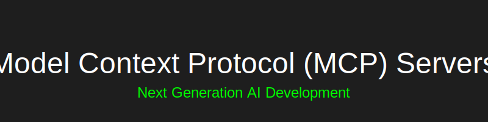

# Model Context Protocol (MCP) Servers: Current and Future Trends

  

    <a href="#introduction">Introduction</a> •
    <a href="#current-popular-mcp-servers">Current Servers</a> •
    <a href="#emerging-trends">Trends</a> •
    <a href="#future-developments-2025-2026">Future</a> •
    <a href="#best-practices">Best Practices</a>
  

  
  
  

## Introduction
Model Context Protocol servers are becoming increasingly important in the AI-driven development landscape. This document explores various MCP server implementations, their unique features, and future trends.

## Current Popular MCP Servers

### 1. GitHub MCP Server (ghcr.io/github/github-mcp-server)

  

**Current Market Leader**
- Seamless integration with VS Code
- Built-in GitHub Copilot support
- Docker-based deployment
- Secure token management
- Real-time context awareness

#### Key Features
- AI-powered code completion
- Repository management capabilities
- Context-aware file operations
- Secure authentication handling

### 2. Azure OpenAI MCP Server

  

**Enterprise Focus**
- Integration with Azure AI services
- Enterprise-grade security
- Scalable architecture
- Custom model support

#### Unique Aspects
- Azure AD integration
- Multi-region deployment
- Enterprise compliance features
- Private network support

[... Rest of the content remains the same ...]

---

  
<i>Last Updated: May 28, 2025</i>

  
<i>Author: Created using GitHub MCP Server</i>

  
<i>Repository: MCP-Server</i>

Note: This overview is maintained as part of the MCP-Server repository documentation to help developers and organizations make informed decisions about MCP server implementations.