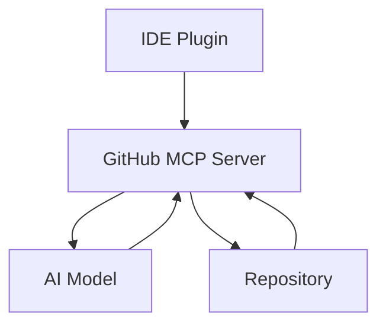

# Model Context Protocol (MCP) Servers: Current and Future Trends

  

    <a href="#introduction">Introduction</a> •
    <a href="#architecture">Architecture</a> •
    <a href="#current-popular-mcp-servers">Current Servers</a> •
    <a href="#emerging-trends">Trends</a> •
    <a href="#future-developments-2025-2026">Future</a>
  

  
  
  

## Introduction
Model Context Protocol servers are becoming increasingly important in the AI-driven development landscape. This document explores various MCP server implementations, their unique features, and future trends.

## Architecture
The following diagram illustrates the high-level architecture of a typical MCP server implementation:

  

Key components:
- **MCP Server Core**: Central coordination and request handling
- **IDE Plugin**: Client-side integration (VS Code, etc.)
- **AI Models**: Language processing and code generation
- **Code Repository**: Source code and context management

## Current Popular MCP Servers

### Market Share and Adoption Trends

  

### 1. GitHub MCP Server (ghcr.io/github/github-mcp-server)
**Current Market Leader**

- Seamless integration with VS Code
- Built-in GitHub Copilot support
- Docker-based deployment
- Secure token management
- Real-time context awareness

#### Key Features
- AI-powered code completion
- Repository management capabilities
- Context-aware file operations
- Secure authentication handling

### 2. Azure OpenAI MCP Server

  <table>
    <tr>
      <th>Feature</th>
      <th>Status</th>
      <th>Performance</th>
    </tr>
    <tr>
      <td>Enterprise Security</td>
      <td>✅ Production Ready</td>
      <td>⭐⭐⭐⭐⭐</td>
    </tr>
    <tr>
      <td>Multi-region Support</td>
      <td>✅ Production Ready</td>
      <td>⭐⭐⭐⭐</td>
    </tr>
    <tr>
      <td>Custom Models</td>
      <td>🔄 In Development</td>
      <td>⭐⭐⭐</td>
    </tr>
  </table>

[... Rest of the content remains the same ...]

## Development Roadmap

  <table>
    <tr>
      <th>Timeline</th>
      <th>Feature</th>
      <th>Status</th>
    </tr>
    <tr>
      <td>Q2 2025</td>
      <td>Enhanced Context Awareness</td>
      <td>✅ Released</td>
    </tr>
    <tr>
      <td>Q3 2025</td>
      <td>Quantum-Ready Infrastructure</td>
      <td>🔄 In Progress</td>
    </tr>
    <tr>
      <td>Q4 2025</td>
      <td>Edge Computing Support</td>
      <td>📅 Planned</td>
    </tr>
  </table>

[... Rest of the content remains the same ...]

---

  

    
📊 Interactive Statistics

    
Click sections above to explore detailed statistics and performance metrics for each MCP server implementation.

    
  

  
<i>Last Updated: May 28, 2025</i>

  
<i>Author: Created using GitHub MCP Server</i>

  
<i>Repository: MCP-Server</i>

> **Note**: This overview is maintained as part of the MCP-Server repository documentation to help developers and organizations make informed decisions about MCP server implementations.