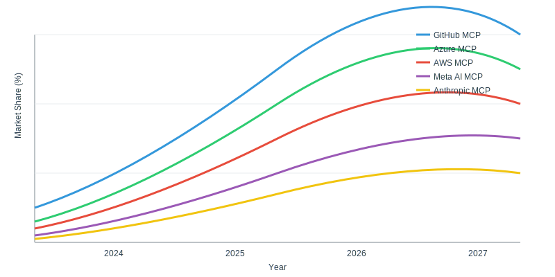

[Previous content until Market Analysis section...]

## 📊 Market Analysis

### Current Leaders (2025)
<div align="center">
  
</div>

#### Detailed Market Share Analysis
<div class="market-leaders">
  <table>
    <tr>
      <th>Provider</th>
      <th>Market Share</th>
      <th>Key Strengths</th>
      <th>Target Audience</th>
    </tr>
    <tr>
      <td>GitHub MCP</td>
      <td>40%</td>
      <td>
        • Native GitHub integration<br>
        • Copilot synergy<br>
        • Developer-first approach
      </td>
      <td>Individual developers, Teams</td>
    </tr>
    <tr>
      <td>Azure OpenAI MCP</td>
      <td>25%</td>
      <td>
        • Enterprise security<br>
        • Compliance features<br>
        • Azure ecosystem
      </td>
      <td>Enterprise, Government</td>
    </tr>
    <tr>
      <td>AWS CodeWhisperer</td>
      <td>20%</td>
      <td>
        • AWS integration<br>
        • Serverless architecture<br>
        • Pay-per-use model
      </td>
      <td>Cloud-native teams</td>
    </tr>
    <tr>
      <td>Others</td>
      <td>15%</td>
      <td>
        • Specialized features<br>
        • Domain expertise<br>
        • Custom solutions
      </td>
      <td>Niche markets</td>
    </tr>
  </table>
</div>

### Other Notable MCP Providers

#### 1. Meta AI MCP
<div class="meta-mcp">
  <table>
    <tr>
      <th>Feature</th>
      <th>Description</th>
      <th>Status</th>
    </tr>
    <tr>
      <td>Llama Integration</td>
      <td>Native support for Llama 2 models</td>
      <td>✅ Released</td>
    </tr>
    <tr>
      <td>Open Source Focus</td>
      <td>Community-driven development</td>
      <td>✅ Active</td>
    </tr>
    <tr>
      <td>PyTorch Integration</td>
      <td>Deep learning optimizations</td>
      <td>✅ Released</td>
    </tr>
  </table>
</div>

#### 2. Anthropic Claude MCP
<div class="anthropic-mcp">
  <table>
    <tr>
      <th>Feature</th>
      <th>Description</th>
      <th>Status</th>
    </tr>
    <tr>
      <td>Constitutional AI</td>
      <td>Enhanced safety and ethics</td>
      <td>✅ Released</td>
    </tr>
    <tr>
      <td>Context Window</td>
      <td>100k+ token support</td>
      <td>✅ Released</td>
    </tr>
    <tr>
      <td>Specialized APIs</td>
      <td>Domain-specific endpoints</td>
      <td>🔄 Beta</td>
    </tr>
  </table>
</div>

#### 3. DeepMind MCP
<div class="deepmind-mcp">
  <table>
    <tr>
      <th>Feature</th>
      <th>Description</th>
      <th>Status</th>
    </tr>
    <tr>
      <td>AlphaCode Integration</td>
      <td>Advanced code generation</td>
      <td>✅ Released</td>
    </tr>
    <tr>
      <td>Research Focus</td>
      <td>Cutting-edge AI capabilities</td>
      <td>✅ Active</td>
    </tr>
    <tr>
      <td>Multi-Agent Systems</td>
      <td>Collaborative coding</td>
      <td>🔄 Beta</td>
    </tr>
  </table>
</div>

#### 4. Hugging Face MCP
<div class="huggingface-mcp">
  <table>
    <tr>
      <th>Feature</th>
      <th>Description</th>
      <th>Status</th>
    </tr>
    <tr>
      <td>Model Hub Integration</td>
      <td>Access to thousands of models</td>
      <td>✅ Released</td>
    </tr>
    <tr>
      <td>Community Features</td>
      <td>Collaborative development</td>
      <td>✅ Active</td>
    </tr>
    <tr>
      <td>Custom Training</td>
      <td>Model fine-tuning capabilities</td>
      <td>✅ Released</td>
    </tr>
  </table>
</div>

## 🔮 Trend Analysis (Continued)

### 3. Federated MCP Systems
<div class="federated-mcp">
  <h4>Architecture Overview</h4>
  ```mermaid
  graph TD
    A[Local MCP Node] -->|Sync| B[Federation Hub]
    C[Local MCP Node] -->|Sync| B
    D[Local MCP Node] -->|Sync| B
    B -->|Aggregation| E[Global Model]
    E -->|Update| A
    E -->|Update| C
    E -->|Update| D
  ```

  <table>
    <tr>
      <th>Component</th>
      <th>Implementation</th>
      <th>Benefits</th>
    </tr>
    <tr>
      <td>Local Processing</td>
      <td>
        • Edge computing<br>
        • Local model inference<br>
        • Data preprocessing
      </td>
      <td>
        • Reduced latency<br>
        • Data privacy<br>
        • Offline capability
      </td>
    </tr>
    <tr>
      <td>Federation Hub</td>
      <td>
        • Model aggregation<br>
        • Weight averaging<br>
        • Update distribution
      </td>
      <td>
        • Collaborative learning<br>
        • Knowledge sharing<br>
        • Global improvements
      </td>
    </tr>
    <tr>
      <td>Privacy Features</td>
      <td>
        • Differential privacy<br>
        • Secure aggregation<br>
        • Encrypted updates
      </td>
      <td>
        • Data protection<br>
        • Regulatory compliance<br>
        • Trust enhancement
      </td>
    </tr>
  </table>
</div>

### 4. Zero-Trust MCP Implementation
<div class="zero-trust-mcp">
  <h4>Security Framework</h4>
  <table>
    <tr>
      <th>Layer</th>
      <th>Components</th>
      <th>Implementation</th>
    </tr>
    <tr>
      <td>Identity</td>
      <td>
        • Multi-factor auth<br>
        • Biometric verification<br>
        • Device attestation
      </td>
      <td>✅ Production</td>
    </tr>
    <tr>
      <td>Network</td>
      <td>
        • Micro-segmentation<br>
        • Real-time monitoring<br>
        • Threat detection
      </td>
      <td>✅ Production</td>
    </tr>
    <tr>
      <td>Data</td>
      <td>
        • End-to-end encryption<br>
        • Key rotation<br>
        • Access logging
      </td>
      <td>✅ Production</td>
    </tr>
  </table>
</div>

### 5. Quantum-Ready Features
<div class="quantum-mcp">
  <h4>Implementation Roadmap</h4>
  <table>
    <tr>
      <th>Phase</th>
      <th>Features</th>
      <th>Timeline</th>
    </tr>
    <tr>
      <td>Phase 1</td>
      <td>
        • Post-quantum cryptography<br>
        • Quantum-resistant algorithms<br>
        • Key encapsulation
      </td>
      <td>Q3 2025</td>
    </tr>
    <tr>
      <td>Phase 2</td>
      <td>
        • Quantum circuit optimization<br>
        • Hybrid classical-quantum processing<br>
        • NISQ device integration
      </td>
      <td>Q1 2026</td>
    </tr>
    <tr>
      <td>Phase 3</td>
      <td>
        • Full quantum advantage<br>
        • Error correction<br>
        • Quantum ML acceleration
      </td>
      <td>2027+</td>
    </tr>
  </table>
</div>

[Rest of the original content continues...]